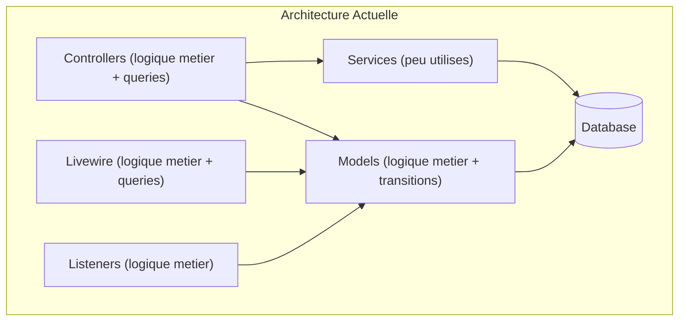
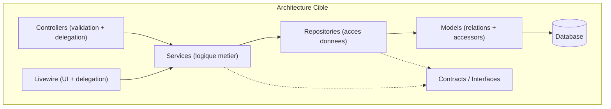

# Plan de transformation : Architecture Repository-Service-Controller

## Etat actuel du codebase

### Problemes identifies

- **43 controllers** dont ~25 contiennent de la logique metier directe (requetes Eloquent, calculs, validations complexes)
- **9 composants Livewire** avec logique metier dans les composants
- **SourcingOrder model** (~460 lignes) avec transitions de statut, tracking, calculs de couts
- **GoogleSheetService** (~1128 lignes) - service monolithique
- **15 listeners** dont la majorite contiennent de la logique metier
- **Aucun repository** - requetes Eloquent directement dans les controllers
- **1 seule interface** (`SheetIntegrationInterface`)

### Architecture actuelle



### Architecture cible



---

## Phase 1 : Fondations (Contracts + Repositories)

### 1.1 Creer les interfaces Repository

Creer `app/Contracts/Repositories/` avec les interfaces suivantes :

- `SourcingOrderRepositoryInterface` - CRUD + requetes complexes (filtrage, recherche, stats)
- `SourcingRequestRepositoryInterface` - CRUD + filtrage + assignation
- `QuotationRepositoryInterface` - CRUD + filtrage
- `RefundRequestRepositoryInterface` - CRUD + stats + filtrage
- `UserRepositoryInterface` - CRUD + recherche par role
- `ShippingFeeRepositoryInterface` - CRUD + import

Chaque interface definit les methodes de requetes utilisees dans les controllers :

- `findById(int $id)`
- `findWithRelations(int $id, array $relations)`
- `paginate(array $filters, int $perPage)`
- `create(array $data)`
- `update(int $id, array $data)`
- `delete(int $id)`
- Plus des methodes specifiques au domaine

### 1.2 Implementer les Repositories

Creer `app/Repositories/` avec les implementations Eloquent :

- `EloquentSourcingOrderRepository.php` : extraire les requetes complexes de `Admin/SourcingOrderController` (index, filtering, search, stats)
- `EloquentSourcingRequestRepository.php` : extraire les requetes de `Admin/AdminSourcingRequestController` et `SourcingRequestController`
- `EloquentQuotationRepository.php` : extraire les requetes de `Admin/QuotationController`
- `EloquentRefundRequestRepository.php` : extraire les requetes de `Admin/RefundRequestController` et `Client/RefundRequestController`
- `EloquentUserRepository.php` : extraire les requetes de `Admin/UserController` et `Admin/SuperAdminController`

### 1.3 Enregistrer les bindings dans AppServiceProvider

```php
$this->app->bind(SourcingOrderRepositoryInterface::class, EloquentSourcingOrderRepository::class);
$this->app->bind(SourcingRequestRepositoryInterface::class, EloquentSourcingRequestRepository::class);
$this->app->bind(QuotationRepositoryInterface::class, EloquentQuotationRepository::class);
$this->app->bind(RefundRequestRepositoryInterface::class, EloquentRefundRequestRepository::class);
$this->app->bind(UserRepositoryInterface::class, EloquentUserRepository::class);
```

---

## Phase 2 : Extraction des Services metier

### 2.1 Services a creer (nouveaux)

#### `app/Services/Order/OrderStatusService.php`

- **Extraire de** : `SourcingOrder` model (canTransitionTo, canTransitionToFromTracking), `SourcingOrderWorkflow` Livewire, `Admin/SourcingOrderController::updateStatus()`
- **Methodes** : `transitionTo()`, `canTransition()`, `getAvailableTransitions()`

#### `app/Services/Order/OrderTrackingService.php`

- **Extraire de** : `SourcingOrder` model (FSB logic, virtual tracking), `SourcingOrderWorkflow::updateTracking()`, `InitializeFsbTracking` listener
- **Methodes** : `initializeFsbTracking()`, `assignRealTracking()`, `resolveFsbNumber()`, `getVirtualStatus()`

#### `app/Services/Order/OrderFinancialService.php`

- **Extraire de** : `Admin/SourcingOrderController::updateFinancials()`, `CopyEstimatesToSourcingOrder` listener, `Quotation::calculateEstimatedProfit()`
- **Methodes** : `updateFinancials()`, `copyEstimates()`, `calculateProfit()`, `getCostVariance()`

#### `app/Services/Request/SourcingRequestStatusService.php`

- **Extraire de** : `SourcingRequest` model (canTransitionTo, transitionTo, claim, release), listeners `UpdateSourcingRequestStatusOn*`
- **Methodes** : `transitionTo()`, `claim()`, `release()`, `updateOnQuotationCreated()`, `updateOnQuotationAccepted()`, `updateOnQuotationRejected()`

#### `app/Services/Quotation/QuotationService.php`

- **Extraire de** : `Admin/QuotationController` (store/update calculs), `Client/QuotationController::accept()` (creation order)
- **Methodes** : `create()`, `update()`, `accept()`, `reject()`, `negotiate()`, `calculateAmount()`

#### `app/Services/Refund/RefundService.php`

- **Extraire de** : `Client/RefundRequestController::store()`, `Admin/RefundRequestController::updateStatus()`
- **Methodes** : `create()`, `approve()`, `reject()`, `validateAmount()`, `getCumulativeRefunded()`

#### `app/Services/Report/ReportService.php`

- **Extraire de** : `Admin/ReportController` et `Admin/FinancialReportController` (toute la logique de calcul)
- **Methodes** : `getSalesMarginReport()`, `getFinancialReport()`, `getRefundsReport()`, `calculateTotalsByOriginalCurrency()`, `getWeeklyProfitChartData()`

#### `app/Services/Notification/NotificationService.php`

- **Extraire de** : `NotificationController`, listeners `Send*Notification`
- **Methodes** : `notifyAdmins()`, `notifyClient()`, `getRelevantAdmins()`, `markAsRead()`, `clearAll()`

#### `app/Services/Admin/AdminUserService.php`

- **Extraire de** : `Admin/SuperAdminController`, `Admin/AdminSourcingRequestController::store()` (creation user)
- **Methodes** : `createAdmin()`, `updateAdmin()`, `createClientFromRequest()`, `generatePassword()`

### 2.2 Services existants a refactorer

#### `app/Services/GoogleSheetService.php` (1128 lignes) - Decouper en :

- `app/Services/Sheet/GoogleSheetClientService.php` : authentification, connexion, creation sheet
- `app/Services/Sheet/GoogleSheetFormattingService.php` : headers, styles, conditional formatting
- `app/Services/Sheet/GoogleSheetDataService.php` : upsert, append, batch operations
- Garder `GoogleSheetService` comme facade qui delegue aux trois

#### `app/Services/LarkSheetService.php` (548 lignes) - Meme approche :

- `app/Services/Sheet/LarkSheetClientService.php` : authentification, tokens
- `app/Services/Sheet/LarkSheetDataService.php` : operations CRUD

### 2.3 Interfaces de service a creer

Dans `app/Contracts/Services/` :

- `OrderStatusServiceInterface`
- `OrderTrackingServiceInterface`
- `QuotationServiceInterface`
- `RefundServiceInterface`
- `ReportServiceInterface`

---

## Phase 3 : Refactoring des Controllers

### Principe : chaque controller ne fait que

1. Valider l'input (via FormRequest)
2. Appeler le service
3. Retourner la reponse (vue ou redirect)

### Controllers prioritaires (les plus charges en logique metier)

#### `Admin/SourcingOrderController.php` (~517 lignes -> ~200 lignes)

- `index()` : deleguer filtrage a `SourcingOrderRepository::paginate()`
- `updateStatus()` : deleguer a `OrderStatusService::transitionTo()`
- `updateFinancials()` : deleguer a `OrderFinancialService::updateFinancials()`
- `updateTracking()` : deleguer a `OrderTrackingService::assignRealTracking()`
- `syncToGoogleSheet()` : deleguer a `GoogleSheetService`
- Creer `StoreSourcingOrderRequest`, `UpdateFinancialsRequest`, `UpdateTrackingRequest` FormRequests

#### `Admin/ReportController.php` (~227 lignes -> ~50 lignes)

- Deleguer tous les calculs a `ReportService`

#### `Admin/QuotationController.php` (~395 lignes -> ~150 lignes)

- `store()/update()` : deleguer calculs a `QuotationService`
- Creer `StoreQuotationRequest`, `UpdateQuotationRequest` FormRequests

#### `Client/QuotationController.php` (~137 lignes -> ~60 lignes)

- `accept()` : deleguer a `QuotationService::accept()`

#### `Client/RefundRequestController.php` (~165 lignes -> ~60 lignes)

- `store()` : deleguer a `RefundService::create()`

#### `Admin/RefundRequestController.php` (~150 lignes -> ~60 lignes)

- `updateStatus()` : deleguer a `RefundService::approve()/reject()`

### Autres controllers a refactorer

- `Admin/AdminSourcingRequestController` : deleguer creation user a `AdminUserService`, assignation a `SourcingRequestStatusService`
- `Admin/FinancialReportController` : deleguer a `ReportService`
- `Admin/ShipmentCalendarController` : creer `ShipmentCalendarService` pour la logique de timeline
- `SourcingRequestController` (root) : deleguer a `SourcingRequestRepository`
- `NotificationController` : deleguer a `NotificationService`

---

## Phase 4 : Nettoyage des Models

### `SourcingOrder.php` (~460 lignes -> ~150 lignes)

Supprimer apres extraction vers les services :

- `canTransitionTo()`, `canTransitionToFromTracking()` -> `OrderStatusService`
- `resolveFsbNumberToOrder()`, `resolveFsbNumberToOrderAndDestinationIndex()`, `getFsbTrackingNumberForDestinationIndex()`, `hasRealTracking()`, `shouldUseVirtualStatus()`, `getVirtualTrackingStatus()` -> `OrderTrackingService`
- `getCostVariance()`, `toGoogleSheetArray()`, `toShippingCompanySheetArray()` -> Services respectifs

Garder dans le model :

- Relations (user, quotation, shippingCompany, etc.)
- Accessors simples (display_id, client_status, fsb_tracking_number, total_quantity)
- Constantes (STATUSES)

### `SourcingRequest.php` (~210 lignes -> ~80 lignes)

Supprimer apres extraction :

- `canTransitionTo()`, `transitionTo()`, `claim()`, `release()` -> `SourcingRequestStatusService`

### `GoogleSheetSyncLog.php` (~259 lignes -> ~80 lignes)

Extraire les methodes de presentation vers un `SyncLogPresenter` ou un trait.

---

## Phase 5 : Refactoring des Listeners

Simplifier chaque listener pour qu'il delegue au service :

```php
// Avant
class InitializeFsbTracking {
    public function handle(SourcingOrderStatusChanged $event) {
        // 30 lignes de logique metier
    }
}

// Apres
class InitializeFsbTracking {
    public function handle(SourcingOrderStatusChanged $event) {
        app(OrderTrackingService::class)->initializeFsbTracking($event->sourcingOrder);
    }
}
```

Listeners a refactorer :

- `InitializeFsbTracking` -> deleguer a `OrderTrackingService`
- `CopyEstimatesToSourcingOrder` -> deleguer a `OrderFinancialService`
- `UpdateSourcingRequestStatusOnQuotationCreated/Accepted/Rejected` -> deleguer a `SourcingRequestStatusService`
- `SyncOrderToSheet` -> deja deleguant, simplifier
- `Send*Notification` listeners -> deleguer la logique de routing a `NotificationService`

---

## Phase 6 : Refactoring Livewire

- `Admin/SourcingOrderWorkflow` : deleguer a `OrderStatusService`, `OrderTrackingService`
- `Admin/SourcingRequestWorkflow` : deleguer a `SourcingRequestStatusService`
- `Admin/SourcingRequestCreate` : deleguer a `AdminUserService`, `SourcingRequestRepository`

---

## Ordre de priorite d'implementation

1. **Repositories** pour `SourcingOrder`, `SourcingRequest`, `Quotation` (fondation)
2. **OrderStatusService** + **OrderTrackingService** (plus gros volume de logique dupliquee)
3. **QuotationService** + **RefundService** (operations critiques)
4. **ReportService** (controllers les plus charges)
5. **Decoupage GoogleSheetService/LarkSheetService**
6. **Nettoyage models** (supprimer logique extraite)
7. **Refactoring listeners et Livewire**
8. **FormRequests** pour validation

---

## Structure finale des dossiers

```
app/
  Contracts/
    Repositories/
      SourcingOrderRepositoryInterface.php
      SourcingRequestRepositoryInterface.php
      QuotationRepositoryInterface.php
      RefundRequestRepositoryInterface.php
      UserRepositoryInterface.php
    Services/
      OrderStatusServiceInterface.php
      OrderTrackingServiceInterface.php
      QuotationServiceInterface.php
      RefundServiceInterface.php
    SheetIntegrationInterface.php (existant)
  Repositories/
    EloquentSourcingOrderRepository.php
    EloquentSourcingRequestRepository.php
    EloquentQuotationRepository.php
    EloquentRefundRequestRepository.php
    EloquentUserRepository.php
  Services/
    Order/
      OrderStatusService.php
      OrderTrackingService.php
      OrderFinancialService.php
    Request/
      SourcingRequestStatusService.php
    Quotation/
      QuotationService.php
    Refund/
      RefundService.php
    Report/
      ReportService.php
    Notification/
      NotificationService.php
    Admin/
      AdminUserService.php
    Sheet/
      GoogleSheetClientService.php
      GoogleSheetFormattingService.php
      GoogleSheetDataService.php
      LarkSheetClientService.php
      LarkSheetDataService.php
    SheetIntegrationFactory.php (existant)
    ShippingLabelImageService.php (existant)
    ImageProcessingService.php (existant)
    AuthLogService.php (existant)
    ...
  Http/
    Requests/ (FormRequests a creer)
      Admin/
        StoreSourcingOrderRequest.php
        UpdateFinancialsRequest.php
        UpdateTrackingRequest.php
        StoreQuotationRequest.php
        UpdateQuotationRequest.php
      Client/
        StoreRefundRequest.php
        AcceptQuotationRequest.php
```

---

## Regles a respecter pendant la migration

- Migrer un controller/service a la fois, tester avant de passer au suivant
- Ne pas casser les fonctionnalites existantes (les tests doivent passer)
- Les repositories ne contiennent QUE des requetes de donnees
- Les services contiennent TOUTE la logique metier
- Les controllers ne font QUE : valider, deleguer, repondre
- Les models ne contiennent QUE : relations, accessors, casts, constantes
