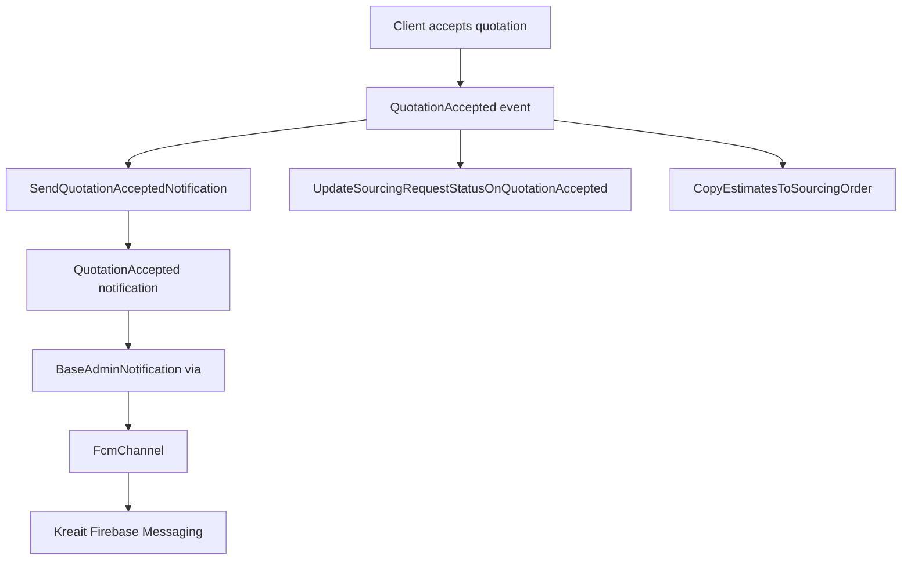

# Notifications + FCM Audit

## Production Errors Investigated

1. `Call to undefined method App\Notifications\QuotationNegotiationRequested::toFcm()`
2. `Attempt to read property "id" on null` around `QuotationAccepted`

## Root Causes

- `app/Channels/FcmChannel.php` always calls `$notification->toFcm($notifiable)` when channel `fcm` is selected.
- `app/Notifications/BaseAdminNotification.php` was adding `fcm` for admins with token, even when notification class had no `toFcm`.
- `app/Notifications/QuotationNegotiationRequested.php` had no `toFcm`.
- `app/Notifications/QuotationAccepted.php` dereferenced nested relations without guards (`order->id`, `sourcingRequest->user->name`).
- Some notifications implemented `toFcm` but returned arrays, while `FcmChannel` requires a `CloudMessage`.

## Workflow (Quotation Accepted)

## Before / After Summary

### 1) Missing `toFcm` on negotiation notification

- Before: class selected `fcm` via base class but did not implement `toFcm`.
- After: `QuotationNegotiationRequested` now returns a valid `CloudMessage`.

### 2) Null dereference in quotation accepted flow

- Before: direct relation access without guards.
- After:
  - `loadMissing(['order', 'sourcingRequest.user'])` in notification/listener.
  - Null-safe access (`?->`) and fallback values/routes.
  - Guard clauses in listeners with structured logs.

### 3) Invalid FCM payload type

- Before: some notifications returned arrays in `toFcm`.
- After: those notifications now return `CloudMessage` consistently.

## Files Updated

- `app/Notifications/BaseAdminNotification.php`
- `app/Notifications/QuotationNegotiationRequested.php`
- `app/Notifications/QuotationAccepted.php`
- `app/Listeners/SendQuotationAcceptedNotification.php`
- `app/Listeners/UpdateSourcingRequestStatusOnQuotationAccepted.php`
- `app/Notifications/SourcingRequestAssigned.php`
- `app/Notifications/SourcingRequestAutoAssigned.php`
- `app/Notifications/ClientRegisteredForAdmins.php`

## Logging Improvements

When required relations are missing, warnings/errors now include:

- `quotation_id`
- `sourcing_request_id`
- `user_id` (when available)
- `relation_missing`

This makes production debugging deterministic and searchable.

## Stability Rules Going Forward

1. Any notification that can return `fcm` in `via()` must implement `toFcm`.
2. `toFcm` must return `Kreait\Firebase\Messaging\CloudMessage`.
3. Notification constructors or methods should pre-load required relations with `loadMissing`.
4. Never dereference nested relations in notifications/listeners without guards/fallback.
5. Use structured logs with IDs for every exceptional path.

## Recommended Preventive Checks

- Add lightweight unit tests for:
  - `QuotationNegotiationRequested::toFcm` returns `CloudMessage`
  - `QuotationAccepted` does not crash when order/user relations are missing
- Add static grep/CI check to detect `public function toFcm(...): array`.
- During code review, treat notification relation chains as high-risk paths.
