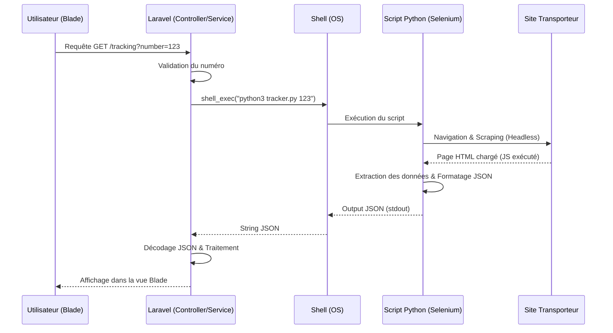

# Rapport Technique : Intégration du Tracking Colis via Python (Selenium) & Laravel

## 1. Introduction

Ce document détaille l'architecture et la procédure d'intégration d'un module de suivi de colis dans l'application Laravel **Sourcing App**. Ce module a pour objectif de récupérer les statuts de livraison depuis les sites de transporteurs qui ne proposent pas d'API publique et qui utilisent des protections anti-bot complexes.

### Pourquoi Selenium ?
Contrairement aux requêtes HTTP standard (cURL, Guzzle), **Selenium** permet de :
- Simuler un véritable navigateur web (Chrome/Firefox).
- Exécuter le Javascript nécessaire au chargement des données de tracking.
- Contourner certaines protections anti-scraping basiques (User-Agent, délais, interactions humaines).

L'exécution de scripts Python via Laravel permet de combiner la robustesse du backend PHP avec la puissance des outils de scraping de l'écosystème Python.

---

## 2. Architecture Globale

Le système repose sur une interaction synchrone (ou asynchrone via Queues) entre le serveur web Laravel et un processus système Python.

### Schéma Logique



### Rôle des Composants
- **Blade** : Interface utilisateur pour la saisie du numéro et l'affichage de la timeline.
- **Service Laravel** : Orchestre l'appel système et sécurise les entrées/sorties.
- **Script Python** : "Worker" éphémère qui lance un navigateur, récupère la donnée brute et la nettoie.

---

## 3. Structure des Fichiers

L'intégration nécessite l'ajout de fichiers spécifiques dans l'arborescence existante du projet Sourcing App.

```bash
/c/xampp/htdocs/sourcing-app/
├── app/
│   ├── Http/
│   │   └── Controllers/
│   │       └── Client/
│   │           └── TrackingController.php    # (Existant) Point d'entrée
│   └── Services/
│       └── PythonTrackingService.php         # (Nouveau) Wrapper pour shell_exec
├── python_scripts/                           # (Nouveau Dossier)
│   ├── scrapers/
│   │   └── carrier_tracker.py                # Script Selenium
│   ├── requirements.txt                      # Dépendances (selenium, webdriver-manager)
│   └── driver/                               # (Optionnel) Drivers Chrome locaux
└── resources/
    └── views/
        └── client/
            └── tracking/
                └── selenium_result.blade.php # Vue partielle pour l'affichage
```

---

## 4. Flux d’Exécution

1.  **Saisie** : L'utilisateur entre un numéro de colis valide.
2.  **Appel** : Le `TrackingController` appelle `PythonTrackingService::track($number)`.
3.  **Exécution** : Le service construit la commande bash :
    `python3 /chemin/vers/carrier_tracker.py "NUMBER_SECURISE"`
4.  **Scraping** : Python lance Chrome en mode `headless`, va sur l'URL cible, attend le chargement du tableau de suivi, et extrait les lignes (Date, Lieu, Statut).
5.  **Retour** : Le script imprime **uniquement** le JSON final dans la sortie standard (`print(json_output)`).
6.  **Affichage** : Laravel décode le JSON. En cas d'erreur (JSON invalide, timeout), une exception est gérée et un message utilisateur est affiché.

---

## 5. Description du Script Python

Le script Python est conçu pour être autonome et robuste. Il utilise la librairie `selenium`.

### Algorithme du script (`carrier_tracker.py`)

```python
import sys
import json
from selenium import webdriver
from selenium.webdriver.chrome.options import Options
from selenium.webdriver.common.by import By
from selenium.webdriver.support.ui import WebDriverWait
from selenium.webdriver.support import expected_conditions as EC

def get_tracking_info(tracking_number):
    # 1. Configuration Headless (Sans interface graphique)
    options = Options()
    options.add_argument("--headless")
    options.add_argument("--disable-gpu")
    options.add_argument("--no-sandbox")
    options.add_argument("user-agent=Mozilla/5.0...") # Simulation navigateur réel

    driver = webdriver.Chrome(options=options)
    
    result = {"success": False, "data": [], "error": None}

    try:
        # 2. Navigation
        url = f"https://site-transporteur.com/track?id={tracking_number}"
        driver.get(url)

        # 3. Attente explicite (Anti-fail)
        # Attendre que le tableau de résultats soit visible (max 10s)
        wait = WebDriverWait(driver, 10)
        table = wait.until(EC.presence_of_element_located((By.CLASS_NAME, "tracking-history")))

        # 4. Extraction
        rows = table.find_elements(By.TAG_NAME, "tr")
        history = []
        for row in rows:
            cols = row.find_elements(By.TAG_NAME, "td")
            if len(cols) >= 3:
                history.append({
                    "date": cols[0].text.strip(),
                    "location": cols[1].text.strip(),
                    "status": cols[2].text.strip(),
                    "details": cols[3].text.strip() if len(cols) > 3 else ""
                })
        
        result["success"] = True
        result["data"] = history

    except Exception as e:
        result["error"] = str(e)
    finally:
        driver.quit()
    
    # 5. Retour JSON sur stdout
    print(json.dumps(result))

if __name__ == "__main__":
    if len(sys.argv) > 1:
        get_tracking_info(sys.argv[1])
    else:
        print(json.dumps({"success": False, "error": "No tracking number provided"}))
```

---

## 6. Intégration Laravel

### Service : `PythonTrackingService.php`

Ce service encapsule la complexité de l'appel système.

```php
namespace App\Services;

use Symfony\Component\Process\Process;
use Symfony\Component\Process\Exception\ProcessFailedException;

class PythonTrackingService
{
    public function track(string $trackingNumber): array
    {
        $scriptPath = base_path('python_scripts/scrapers/carrier_tracker.py');
        
        // Utilisation de escapeshellarg pour la sécurité (injection de commande)
        // Alternative recommandée : Symfony Process Component
        $process = new Process(['python3', $scriptPath, $trackingNumber]);
        $process->setTimeout(30); // Timeout max 30 secondes pour Selenium
        
        try {
            $process->mustRun();
            $output = $process->getOutput();
            
            $json = json_decode($output, true);
            
            if (json_last_error() !== JSON_ERROR_NONE) {
                // Log l'erreur et la sortie brute pour debug
                \Log::error("Tracking JSON Error: " . json_last_error_msg() . " Output: " . $output);
                return ['success' => false, 'error' => 'Invalid response from scraper'];
            }
            
            return $json;
            
        } catch (ProcessFailedException $exception) {
            \Log::error("Tracking Script Error: " . $exception->getMessage());
            return ['success' => false, 'error' => 'Tracking system unavailable'];
        }
    }
}
```

### Controller : `TrackingController`

Modification de la méthode `data` ou création d'une nouvelle méthode spécifique.

```php
public function pythonTrack(Request $request, PythonTrackingService $service)
{
    $request->validate(['number' => 'required|string|alpha_num|max:30']);
    
    $result = $service->track($request->number);
    
    if ($result['success']) {
        return response()->json(['data' => $result['data']]);
    }
    
    return response()->json(['error' => $result['error'] ?? 'Unknown error'], 500);
}
```

---

## 7. Exemple de Données JSON Retournées

Le script Python doit retourner une structure stricte pour être consommée par le frontend.

```json
{
  "success": true,
  "data": [
    {
      "date": "2024-01-09 14:30:00",
      "location": "Dubai, UAE",
      "status": "Delivered",
      "details": "Delivered to reception"
    },
    {
      "date": "2024-01-08 09:15:00",
      "location": "Dubai, UAE",
      "status": "Out for Delivery",
      "details": "Driver: Ahmed"
    },
    {
      "date": "2024-01-05 18:00:00",
      "location": "Guangzhou, CN",
      "status": "Departed Facility",
      "details": "Flight EK305"
    }
  ],
  "error": null
}
```

---

## 8. Gestion des Erreurs

### Types d'erreurs
1.  **Timeout Selenium** : Si la page met trop de temps à charger ou si le sélecteur CSS change.
    - *Action* : Le script Python capture l'exception et retourne `{"success": false, "error": "Timeout"}`.
2.  **Anti-Bot / Captcha** : Le transporteur détecte Selenium.
    - *Action* : Utiliser des services de résolution de captcha tiers ou des proxies résidentiels (étape avancée).
3.  **Erreur Système** : Python non installé ou chemin incorrect.
    - *Action* : Log Laravel (`storage/logs/laravel.log`).
4.  **Données Vides** : Le numéro n'existe pas.
    - *Action* : Retourner un tableau vide et afficher "Aucune donnée" côté Blade.

---

## 9. Déploiement & Environnement

Pour que ce système fonctionne en production (VPS Linux/Windows) :

### Prérequis Serveur
- **Python 3.8+** : `sudo apt install python3 python3-pip`
- **Google Chrome** : Doit être installé sur le serveur.
- **ChromeDriver** : Compatible avec la version de Chrome installée.
- **Librairies Python** :
  ```bash
  pip install selenium webdriver-manager
  ```

### Permissions
L'utilisateur exécutant PHP (ex: `www-data`) doit avoir les droits d'exécution sur le dossier `python_scripts` et l'accès à l'exécutable python.

### Configuration
Utiliser des variables d'environnement (`.env`) pour définir le chemin vers Python, surtout sur Windows (XAMPP).
`PYTHON_PATH="C:\Users\PC\AppData\Local\Programs\Python\Python39\python.exe"`

---

## 10. Limitations & Améliorations Futures

### Limitations Actuelles
- **Performance** : Lancer un navigateur complet prend 2 à 5 secondes par requête. Inadapté pour tracker 100 colis en boucle.
- **Fragilité** : Si le site du transporteur change son HTML, le script casse (maintenance régulière nécessaire).

### Améliorations
1.  **Queue Laravel (Asynchrone)** : Au lieu de faire attendre l'utilisateur ("Loading..."), lancer un Job en arrière-plan `ProcessTracking::dispatch($order)`, stocker le résultat en base de données, et notifier l'utilisateur via WebSockets (Reverb/Pusher).
2.  **Microservice FastAPI** : Au lieu de `shell_exec` (lourd à chaque appel), créer une petite API Python persistante qui garde le navigateur ouvert ou gère mieux le pooling.
3.  **Proxies** : Intégrer la rotation d'IPs pour éviter le bannissement par le site cible.
