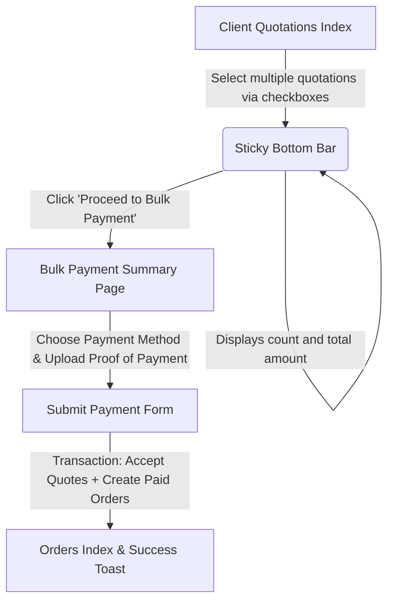

# Technical Specification: Bulk Payment for Multiple Sourcing Requests

This document outlines the design and implementation details for enabling clients to select multiple quoted sourcing requests, calculate their total cost, and perform a single bulk payment (uploading one proof of payment for all selected requests).

---

## 1. User Experience Flow



### Step 1: Multi-Selection on Quotations List
* Checkboxes will be added to each quotation on the **Quotations** index page: [index.blade.php](file:///C:/xampp/htdocs/sourcing-app/resources/views/client/quotations/index.blade.php).
* A sticky bottom bar will appear when at least one quotation is selected.
* It will display:
  * Count of selected quotations.
  * Total price summed in real-time.
  * A button: `Proceed to Bulk Payment` (styled as a premium, orange button matching the site theme).

### Step 2: Bulk Payment Page
* Clicking `Proceed to Bulk Payment` will redirect the user to a new localized client route: `/client/quotations/bulk-payment?ids=q1,q2,q3`.
* This page will show:
  * A summary table listing the selected items, their individual unit prices, commissions, and total costs.
  * The aggregated grand total.
  * Available payment methods.
  * A drag-and-drop file upload input for the proof of payment.

### Step 3: Transaction Processing
* On form submission:
  * Each selected quotation is accepted.
  * A `SourcingOrder` is created for each quotation in `paid` status.
  * The single uploaded proof of payment path is associated with each generated `SourcingOrder`.
  * Proper domain events (like `QuotationAccepted` and `SourcingOrderStatusChanged`) are triggered for each order to ensure notifications are dispatched and Google Sheets are synchronized.

---

## 2. File & Code Modifications

### 2.1 Routing Settings
In [web.php](file:///C:/xampp/htdocs/sourcing-app/routes/web.php), inside the localized client route group:
```php
Route::get('/quotations/bulk-payment', [App\Http\Controllers\Client\QuotationController::class, 'bulkPaymentShow'])->name('quotations.bulk-payment');
Route::post('/quotations/bulk-pay', [App\Http\Controllers\Client\QuotationController::class, 'bulkPay'])->name('quotations.bulk-pay');
```

### 2.2 Controller Methods
We will add two methods to the client's [QuotationController.php](file:///C:/xampp/htdocs/sourcing-app/app/Http/Controllers/Client/QuotationController.php):

1. `bulkPaymentShow(Request $request, string $locale)`:
   * Decodes and validates query parameter `ids` (e.g. `?ids=1,2,3`).
   * Fetches corresponding `Quotation` records with `sourcingRequest` relation.
   * Ensures all requested quotations are owned by the current user and are pending acceptance.
   * Renders the bulk payment view.

2. `bulkPay(Request $request, string $locale, ImageProcessingService $imageService)`:
   * Validates selected quotation IDs, payment method, and the uploaded proof file.
   * Compresses and stores the proof image/PDF.
   * Performs the database transaction:
     * Accepts each quotation.
     * Creates a `SourcingOrder` with `status => 'paid'` and `proof_of_payment_path => $storedPath`.
     * Transitions the quotation and request status to `'accepted'`.
     * Triggers event dispatches (`QuotationAccepted`, `SourcingOrderStatusChanged`, etc.) to run background syncs (Google Sheets, notifications, invoice emails).

### 2.3 View Files
* **Modify** [index.blade.php](file:///C:/xampp/htdocs/sourcing-app/resources/views/client/quotations/index.blade.php):
  * Add checkboxes to the quotation list elements.
  * Add the sticky bottom panel markup.
  * Add vanilla JS to track checkbox state, calculate sums, and handle redirection.
* **Create** `resources/views/client/quotations/bulk-payment.blade.php`:
  * A full screen summary dashboard displaying selected quotations details.
  * The payment details upload interface.

---

## 3. Implementation Verification Plan

1. **Verify Seeding**: Seed test client and super admin users.
2. **Acceptance Test**: Select multiple quotations as client, ensure calculations are correct, upload dummy payment proof, and submit.
3. **Verify Orders State**: Verify that multiple `SourcingOrder` rows are created with `paid` status and link to the same uploaded proof of payment.
